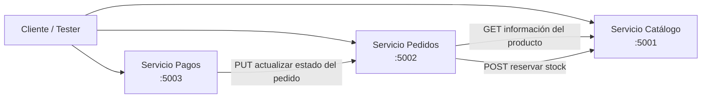

# 🍧 Sistema de Microservicios para Gestión de Paletas


Un backend pequeño pero completo, basado en **microservicios**, para gestionar una tienda de paletas.  
El proyecto está construido con **Flask**, **SQLite** y **comunicación HTTP entre servicios**, modelando un flujo realista donde:

- se crea un producto en el catálogo,
- un pedido valida precio y stock,
- se reserva stock antes de confirmar el pedido,
- se registra un pago,
- y el estado del pedido se actualiza después del pago.

Aunque es un proyecto de aprendizaje, ya demuestra varias ideas importantes del desarrollo backend real: **separación de servicios, autenticación interna con tokens, logging, persistencia de datos, validación de entradas y comunicación entre servicios**.

---

## ✨ Lo más destacado

- **Servicio de Catálogo** para gestionar paletas y stock
- **Servicio de Pedidos** para crear pedidos y reservar inventario
- **Servicio de Pagos** para registrar pagos y actualizar el estado del pedido
- **Una base de datos SQLite por servicio**
- **Protección con Bearer Token** para operaciones internas entre microservicios
- **Logging independiente por microservicio**
- **Diseño REST simple, claro y funcional**

---

## 🧠 Vista general de la arquitectura

Este sistema está dividido en **tres microservicios**, cada uno con su propia responsabilidad y base de datos.



### Servicios

#### 1. Servicio de Catálogo (`app_catalogo.py`)
Se encarga de:
- crear paletas,
- listar productos,
- obtener una paleta específica,
- actualizar paletas,
- reservar stock cuando se crea un pedido.

#### 2. Servicio de Pedidos (`app_pedido.py`)
Se encarga de:
- crear pedidos,
- validar los ítems solicitados,
- consultar al Catálogo por la información del producto,
- reservar stock,
- calcular totales,
- guardar los ítems del pedido,
- exponer el endpoint que usa Pagos para cambiar el estado del pedido.

#### 3. Servicio de Pagos (`app_pago.py`)
Se encarga de:
- registrar un pago,
- validar autorización interna,
- notificar a Pedidos que el pago fue aprobado.

---

## 🔄 Flujo principal del negocio

### Flujo de creación de pedido

1. Un cliente envía una solicitud para crear un pedido.
2. El servicio de **Pedidos** valida el payload.
3. Pedidos consulta a **Catálogo** para obtener cada paleta y su precio.
4. Pedidos vuelve a llamar a **Catálogo** para reservar stock.
5. Pedidos calcula el total y guarda la orden en su propia base de datos.
6. El pedido inicia con el estado **`CREADO`**.

### Flujo de pago

1. Se registra un pago en el servicio de **Pagos**.
2. Pagos almacena el pago con estado **`APROBADO`**.
3. Pagos llama a **Pedidos** para actualizar el estado de la orden.
4. Pedidos cambia el estado del pedido a **`PAGADO`**.

Ese pequeño baile ya muestra bastante bien cómo colaboran los microservicios cuando el sistema empieza a comportarse como sistema, y no solo como CRUD con esteroides.

---

## 🛠️ Tecnologías utilizadas

- **Python**
- **Flask**
- **SQLite**
- **requests** (para llamadas HTTP entre servicios)
- **logging** (para registros de ejecución)

---

## 📁 Estructura sugerida del proyecto

Como los scripts de inicialización de base de datos fueron subidos con el mismo nombre (`crear_db.py`), la versión más ordenada del repositorio podría quedar así:

```bash
.
├── app_catalogo.py
├── app_pedido.py
├── app_pago.py
├── crear_catalogo_db.py
├── crear_pedidos_db.py
├── crear_pagos_db.py
├── README.md
├── catalogo.db
├── pedidos.db
├── pagos.db
├── catalogos.log
├── pedido.log
└── pago.log
```

Si prefieres mantener el nombre original, lo ideal es colocar cada `crear_db.py` dentro de carpetas distintas para que no se sobrescriban entre sí.

---

## 🗄️ Bases de datos

Cada servicio administra su propia base de datos.

### Base de datos de Catálogo
**Archivo:** `catalogo.db`

**Tabla:** `catalogo`
- `id`
- `descripcion`
- `precio`
- `stock`

### Base de datos de Pedidos
**Archivo:** `pedidos.db`

**Tablas:**
- `pedido`
  - `id`
  - `cliente_id`
  - `estado`
  - `total`
- `pedido_items`
  - `id`
  - `pedido_id`
  - `paleta_id`
  - `cantidad`

### Base de datos de Pagos
**Archivo:** `pagos.db`

**Tabla:** `pagos`
- `id`
- `pedido_id`
- `metodo`
- `estado`

---

## 🔐 Autenticación interna

El proyecto utiliza **Bearer Tokens** simples para la comunicación interna entre servicios:

- `PEDIDOS_CATALOGO`
- `PEDIDOS_PAGOS`
- `PAGOS_PEDIDOS`

Para un proyecto académico o de práctica, esta solución funciona bien porque deja claras las fronteras entre servicios.

En un sistema de producción, estos valores deberían moverse a:
- variables de entorno,
- un gestor de secretos,
- o un mecanismo más robusto como OAuth2, JWT o identidad de servicio.

---

## ▶️ Cómo ejecutar el proyecto

### 1. Instalar dependencias

```bash
pip install flask requests
```

### 2. Crear las bases de datos

Primero ejecuta los scripts de creación de base de datos correspondientes.

Si decides renombrarlos:

```bash
python crear_catalogo_db.py
python crear_pedidos_db.py
python crear_pagos_db.py
```

Si mantienes el mismo nombre, asegúrate de guardar cada uno en carpetas distintas antes de ejecutarlos.

### 3. Levantar los microservicios

Abre **tres terminales** y ejecuta:

```bash
python app_catalogo.py
```

```bash
python app_pedido.py
```

```bash
python app_pago.py
```

### 4. Puertos utilizados

- **Catálogo:** `5001`
- **Pedidos:** `5002`
- **Pagos:** `5003`

---

## 📡 Endpoints de la API

### Servicio de Catálogo — `:5001`

| Método | Endpoint | Descripción | Auth |
|---|---|---|---|
| POST | `/paletas` | Crear una nueva paleta | Sí |
| GET | `/paletas` | Listar todas las paletas | No |
| GET | `/paletas/<id>` | Obtener una paleta | No |
| PUT | `/paletas/<id>` | Actualizar una paleta | Sí |
| POST | `/paletas/<id>/reservar` | Reservar stock | Sí |

### Servicio de Pedidos — `:5002`

| Método | Endpoint | Descripción | Auth |
|---|---|---|---|
| POST | `/pedidos` | Crear un nuevo pedido | No |
| GET | `/pedidos/<id>` | Obtener un pedido con sus ítems | No |
| PUT | `/pedidos/<id>/estado` | Actualizar estado del pedido | Sí |

### Servicio de Pagos — `:5003`

| Método | Endpoint | Descripción | Auth |
|---|---|---|---|
| POST | `/pagos` | Registrar un pago | Sí |
| GET | `/pagos/<id>` | Obtener detalle de un pago | No |

---

## 🧪 Ejemplos de uso

### Crear una paleta

```bash
curl -X POST http://127.0.0.1:5001/paletas \
  -H "Content-Type: application/json" \
  -H "Authorization: Bearer PEDIDOS_CATALOGO" \
  -d '{
    "descripcion": "Paleta de frutilla",
    "precio": 12000,
    "stock": 20
  }'
```

### Listar paletas

```bash
curl http://127.0.0.1:5001/paletas
```

### Crear un pedido

```bash
curl -X POST http://127.0.0.1:5002/pedidos \
  -H "Content-Type: application/json" \
  -d '{
    "cliente_id": 1,
    "items": [
      {
        "paleta_id": 1,
        "cantidad": 2
      }
    ]
  }'
```

### Registrar un pago

```bash
curl -X POST http://127.0.0.1:5003/pagos \
  -H "Content-Type: application/json" \
  -H "Authorization: Bearer PEDIDOS_PAGOS" \
  -d '{
    "pedido_id": 1,
    "metodo": "tarjeta"
  }'
```

### Consultar el pedido después del pago

```bash
curl http://127.0.0.1:5002/pedidos/1
```

---

## 📝 Logging

Cada servicio genera su propio archivo de log:

- `catalogos.log`
- `pedido.log`
- `pago.log`

Esto facilita el debugging y le da al proyecto una estructura mucho más realista de backend.

---

## ✅ Qué demuestra bien este proyecto

Este proyecto es especialmente fuerte como pieza de portafolio porque muestra:

- separación de responsabilidades,
- diseño de endpoints REST,
- comunicación entre servicios,
- validación y manejo de errores,
- lógica de reserva de stock,
- persistencia con bases de datos independientes,
- pensamiento backend práctico más allá de una app CRUD básica.

En otras palabras: no es solo “hice tres endpoints”. Ya empieza a pensar como sistema.

---

## 🚧 Posibles mejoras

Si quisieras llevar este proyecto a un nivel aún más sólido, estos serían muy buenos siguientes pasos:

- mover tokens y URLs a **variables de entorno**,
- agregar **Docker / Docker Compose**,
- incluir un **requirements.txt**,
- organizar cada servicio dentro de su propia carpeta,
- agregar **tests unitarios** y **tests de integración**,
- usar **SQLAlchemy** en lugar de consultas SQLite directas,
- añadir documentación con **Swagger / OpenAPI**,
- implementar lógica de **rollback o compensación** si se reserva stock pero falla la creación del pedido,
- agregar más transiciones de estado como `PENDIENTE`, `PAGADO`, `CANCELADO`,
- reemplazar la aprobación fija del pago por una simulación más realista.

Ese último punto importa bastante, porque los sistemas distribuidos tienen una afición sospechosa por romperse de formas creativas a las 2 de la mañana.

---

## 🎯 Por qué este repositorio tiene valor

Este repositorio es una muy buena pieza académica y de portafolio porque combina:

- desarrollo backend,
- modelado de base de datos,
- desarrollo de APIs,
- comunicación entre servicios,
- y modelado de lógica de negocio.

Demuestra que no solo sabes crear endpoints, sino también pensar en **flujo, consistencia, límites del sistema y comportamiento del dominio**.

---

## 👩‍💻 Autor

Desarrollado como proyecto de aprendizaje enfocado en backend, microservicios, Flask, SQLite y diseño orientado a servicios.

---

## 📌 Nota final

Este proyecto es lo bastante simple como para entenderse rápido, pero también lo bastante estructurado como para mostrar bases sólidas de backend. Y ese equilibrio es oro puro para un repositorio de GitHub: accesible, demostrable y técnicamente honesto.
